# Trips and Travel Conversion Rate Analysis
> Repository ini dibuat untuk memenuhi Final Project Data Science Rakamin Batch 35 
> 
> A Final Poject by Data Busters

### Kelompok Data Busters
### Anggota:
1. Aryo Wicaksono as Project Manager
2. Dwi Cahya Nur Faizi as Machine Learning Engineer
3. Karissa Triastari as Business Analyst
4. Raden Treva Agung Rakaputra (MIA) as Data Scientist 
5. Tiolan Sweter Simanjuntak (MIA) as Data Analyst
6. Wahyu Endranaka (MIA) as Data Engineer

Dataset: [Holiday Package Purchase Prediction](https://www.kaggle.com/datasets/susant4learning/holiday-package-purchase-prediction)

## Data Understanding
### Problem:
Menurut [Global Wellness Institute](https://globalwellnessinstitute.org/global-wellness-institute-blog/2021/12/14/the-big-picture-huge-growth-ahead/), pasar Wellness Tourism diproyeksikan tumbuh rata-rata 21% per tahun hingga tahun 2025. Oleh karena itu, perusahaan “Trips & Travel.com” akan mengeluarkan produk terbaru mereka yaitu Wellness Tourism Package, yang mana paket ini dimaksudkan sebagai perjalanan yang memungkinan para traveler untuk mempertahankan, meningkatkan atau memulai gaya hidup sehat, dan mendukung atau meningkatkan kesejahteraan seseorang. Meninjau **data marketing tahun sebelumnya** di mana perusahaan menawarkan 5 produk berbeda, perusahaan mendapatkan **hanya 18% dari total pelanggan yang menerima penawaran produk benar-benar melakukan pembelian**. **Tingkat konversi ini dianggap masih sangat rendah oleh perusahaan**. Perusahaan juga awalnya tidak melihat informasi pelanggan yang tersedia dan hanya menghubungi sejumlah pelanggan secara acak. Melihat angka pelanggan yang membeli produk, **biaya marketing dianggap masih cukup tinggi**.

### Goal:
Dalam usaha ekspansi user base, perusahaan "Trips & Travel.Com" berencana menawarkan produk baru yaitu Wellness Tourism Package. Dalam meluncurkan produk baru, perusahaan ingin:
* Meningkatkan conversion rate dari penawaran produk baru tersebut.
* Meningkatkan efisiensi biaya pemasaran.

### Objectives:
Untuk mengatasi masalah dan memenuhi permintaan dari perusahaan, kami berencana untuk:
* Mengembangkan model yang dapat memprediksi pelanggan yang berpotensi membeli paket baru.
* Mengidentifikasi segmentasi pelanggan yang berpotensi membeli produk baru berdasarkan atribut mereka.

### Business Metrics:
Untuk mengevaluasi pendekatan kami, kami menggunakan 2 bisnis metrik yaitu:
* Conversion rate: Metrik ini mengukur persentase yang akhirnya membeli produk dari total pelanggan yang ditawarkan.
* ROI (Return On Investment): Metrik ini mengukur rasio dari keuntungan dan total biaya marketing.

### Metadata
| Column | Description |
| --- | --- |
| CustomerID | Unique customer ID |
| ProdTaken | Target variable, Whether customer has taken the product or not |
| Age | Age of customer |
| TypeofContact | How customer was contacted (Company Invited or Self Inquiry) |
| CityTier | City tier depends on the development of a city, population, facilities, and living standards. The categories are  |ordered i.e. Tier 1 > Tier 2 > Tier 3
| DurationOfPitch | Duration of the pitch by a salesperson to the customer |
| Occupation | Occupation of customer |
| Gender | Gender of customer |
| NumberOfPersonVisiting | Total number of persons planning to take the trip with the customer |
| NumberOfFollowups | Total number of follow-ups has been done by the salesperson after the sales pitch |
| ProductPitched | Product pitched by the salesperson |
| PreferredPropertyStar | Preferred hotel property rating by customer |
| MaritalStatus | Marital status of customer |
| NumberOfTrips | Average number of trips in a year by customer |
| Passport | The customer has a passport or not (0: No, 1: Yes) |
| PitchSatisfactionScore | Sales pitch satisfaction score |
| OwnCar | Whether the customers own a car or not (0: No, 1: Yes) |
| NumberOfChildrenVisiting | otal number of children with age less than 5 planning to take the trip with the customer |
| Designation | Designation of the customer in the current organization |
| MonthlyIncome | Gross monthly income of the customer |

## Data flow assumption

## Key Insight:
1. Pada marketing tahun sebelumnya, satu jabatan hanya diberikan 1 jenis produk saja

   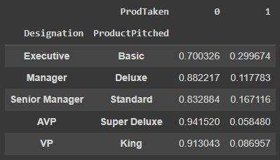

2. Eksekutif sebagai jabatan dengan pendapatan
paling rendah juga dengan umur paling muda. note: 1=Executive, 2=Manager, 3=Senior Manager, 4=AVP, 5=VP.

   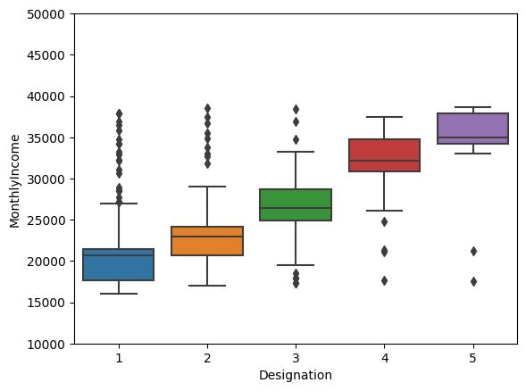
   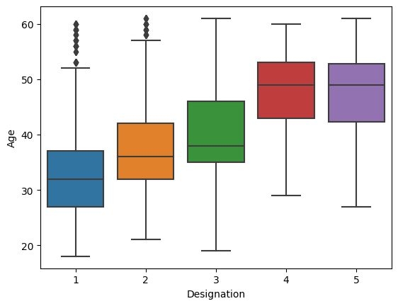

   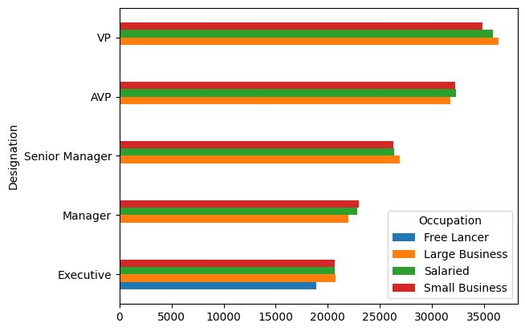

3. Produk basic sekaligus jabatan executive memiliki tingkat konversi yang paling tinggi

   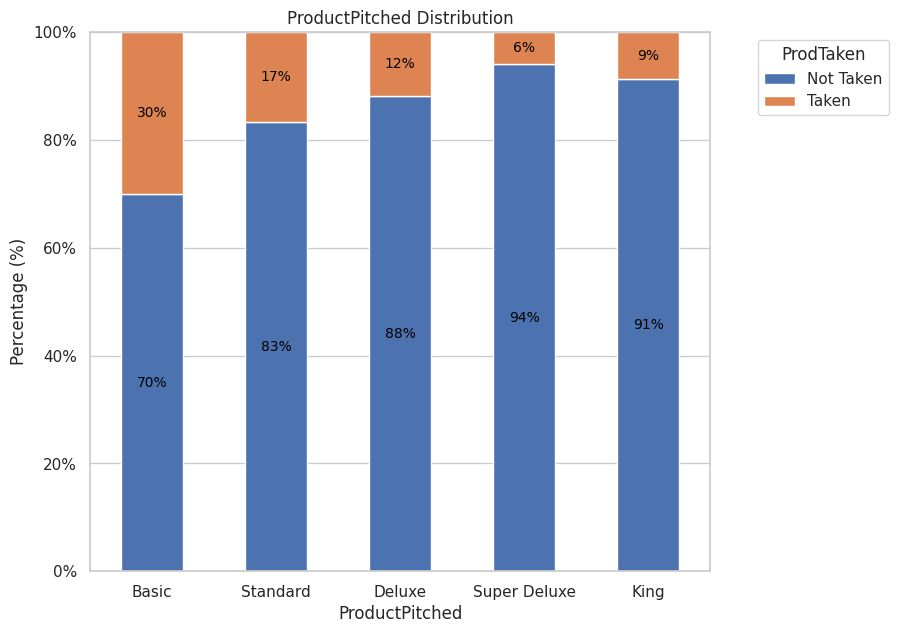

4. Durasi penawaran/promosi paling optimal ada di sekitar 20 menit dan sekitar 30 menit

    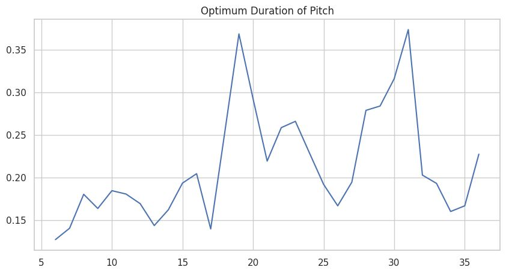

5. Tidak ada produk yang mengharuskan pelanggan untuk memiliki passport

    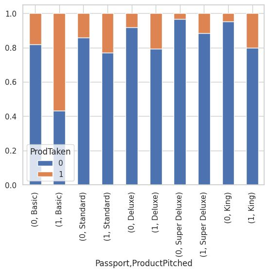

6. Pemilik passport memiliki tingkat konversi lebih tinggi

    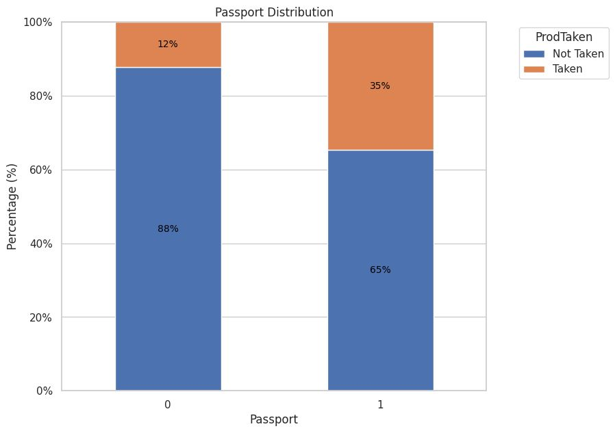

7. Pelanggan yang belum menikah cenderung akan mengambil produk yang ditawarkan. 
Note: Divorced dan Married=pernah menikah, single dan Unmarried=belum pernah menikah

   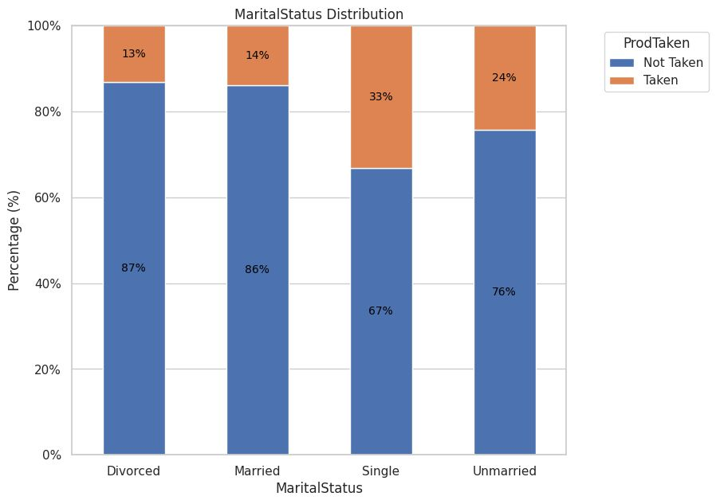

8. Semakin banyak tindak lanjut yang dilakukan oleh sales, semakin tertarik pelanggan untuk mengambil produk yang ditawarkan.

   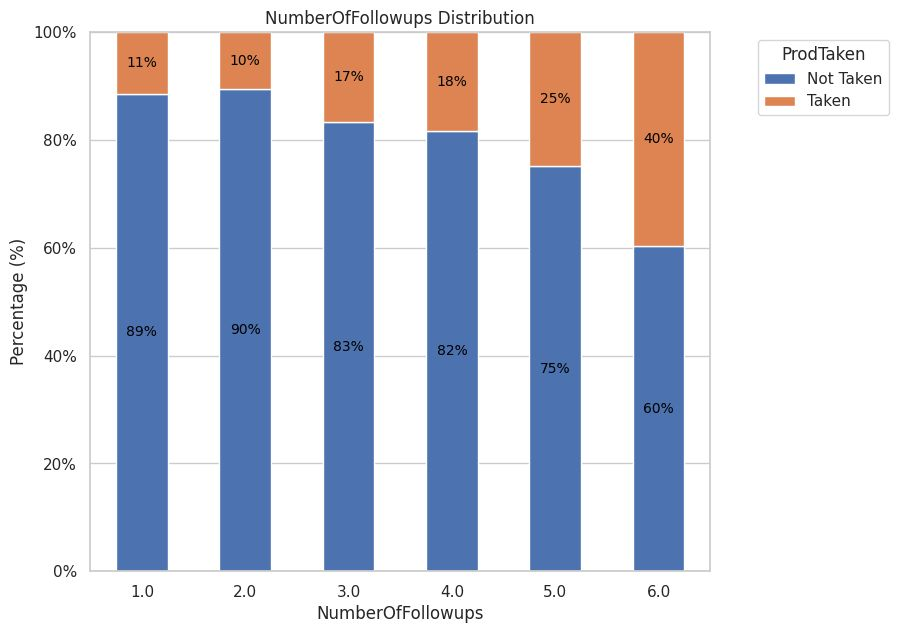

## Build and Evaluate Machine Learning Model

### Initial Model
Model awal yang sudah di tuning parameternya

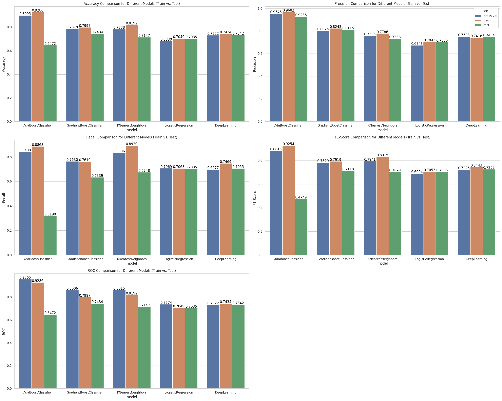

Logistic Regression dan Deep Learning dilanjutkan ke tahap selanjutnya karena 2 model tersebut yang best fit.

### Threshold Tuning

Setelah dilakukan analisa (see code on notebook), threshold terbaik untuk Logistic Regression adalah 0.688571 dan untuk Deep Learning adalah 0.631429

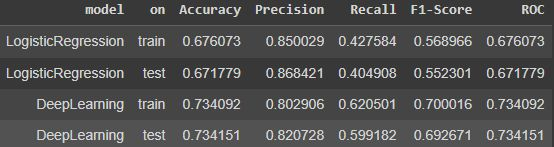

Kami lebih memilih untuk menggunakan Deep Learning karena memiliki nilai Precision yang sudah tinggi dan nilai recall yang tidak telalu jatuh. Namun, pemilihan model seharusnya tetap disesuaikan dengan kebutuhan.

### Confusion Matrix

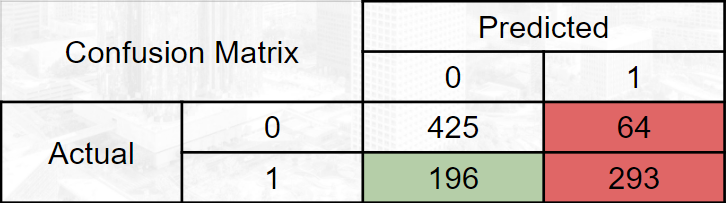

Confusion matrix menunjukkan bahwa terdapat 293 pelanggan yang berhasil diidentifikasikan akan membeli produk, sedangkan terdapat 64 pelanggan yang salah prediksi yang berdampak pada penggunaan biaya yang sia-sia sehingga conversion rate nya = 82%. Lalu terdapat 196 pelanggan yang gagal dideteksi

### Feature Importance

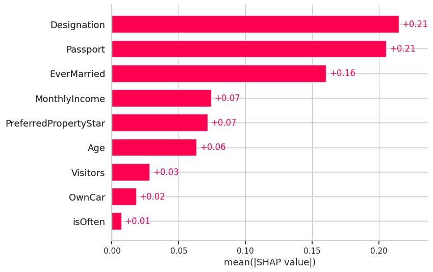
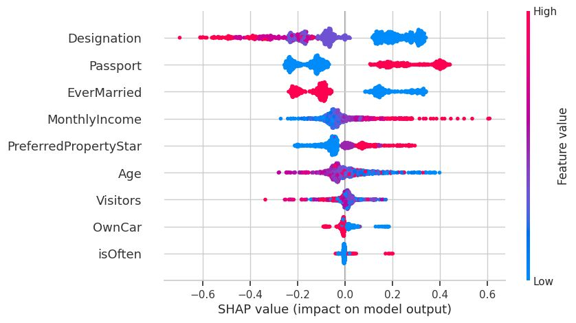

## Business Recommendation

Perusahaan tetap dapat menghubungi pelanggan yang tidak diklasifikasikan oleh model sebagai pelanggan yang potensial dengan tetap memperhatikan fitur yang berdampak tinggi terhadap model dan melalui wawasan/insight dari EDA yang telah dilakukan. Berikut adalah feature importance dari model. Kami merekomendasikan beberapa tindakan diantaranya:

1. **Tetap menawarkan produk baru kepada semua customer**, tidak melihat jabatan mereka. Melalui EDA, kami menemukan bahwa perusahaan sudah melakukan targeted marketing yaitu hanya menawarkan 1 jenis produk pada jabatan tertentu. Kami tidak bisa secara langsung mengambil kesimpulan bahwa jabatan tertentu berpotensi lebih tinggi dalam membeli produk (product-specific problem). Menurut, survey penelitian yang dilakukan oleh [accenture](https://newsroom.accenture.com/news/consumers-see-health-and-well-being-as-essential-spend-category-accenture-survey-finds.htm), masyarakat rela mengorbankan kebutuhan tersier mereka dan mendahulukan membeli paket wellness sehingga rekomendasi ini tidak hanya akan menguntungkan dalam hal analisa di kemudian hari tapi juga sejalan dengan keadaan pasar saat ini.
2. **Targetkan pelanggan yang belum menikah**. Dari EDA dan juga feature importance, pelanggan yang belum menikah memiliki kecenderungan akan membeli produk yang ditawarkan.
3. **Targetkan pelanggan yang memiliki passport**. Sama seperti poin no 2, pelanggan yang memiliki passport cenderung akan membeli produk yang ditawarkan.
4. **Lakukan durasi penawaran di sekitar 20 menit**. Menurut EDA, terdapat 2 sweet spots dalam penyampaian durasi, di menit 19-20 dan 30-31. Mengacu pada artikel dari [Forbes](https://www.forbes.com/sites/carminegallo/2014/11/14/a-new-business-pitch-should-never-last-more-than-18-minutes/?sh=449084ba1607) dan [Inc](https://www.inc.com/carmine-gallo/why-your-next-sales-pitch-should-be-no-longer-than-a-ted-talk.html), 20 menit adalah waktu yang paling tepat.
5. **Lakukan tindak lanjut yang maksimal (6)**. Per data, kami menemukan bahwa semakin banyak dilakukannya tindak lanjut, semakin tinggi kecenderungan pelanggan akan membeli produk yang ditawarkan.